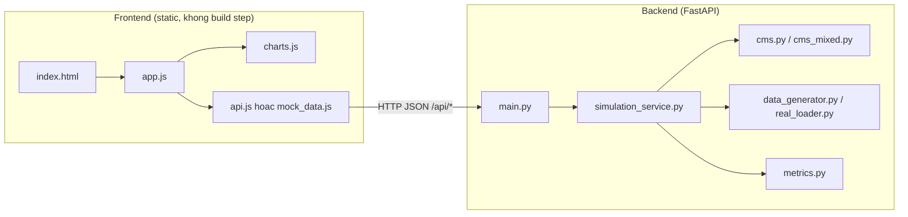
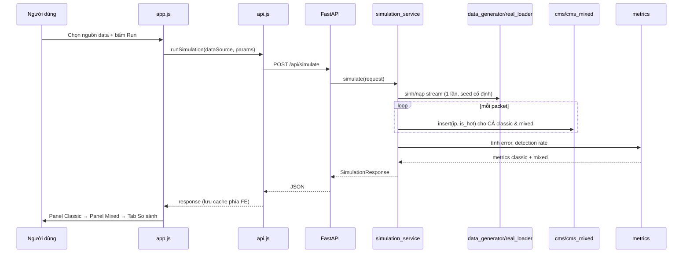

# project_ovr.md — Tổng quan dự án

> File này KHÔNG lặp lại chi tiết API/tên biến (xem `rules.md`) hay việc-của-ai (xem `ai_agents.md`). File này trả lời: **dự án làm gì, kiến trúc ra sao, chạy bằng công nghệ gì, data đi từ đâu tới đâu, đo bằng tham số nào, và làm theo trình tự nào.**
> Phạm vi: **thuần kỹ thuật** phục vụ vibe-code demo. Báo cáo học thuật nộp giáo viên (SRS/UML nếu cần) là tài liệu riêng, không nằm trong file này.

---

## 1. Mục tiêu

Chứng minh bằng số liệu thực nghiệm rằng **Mixed Hypergraph CMS k=(2,5)** phát hiện Elephant flow (DDoS/bandwidth hog) chính xác hơn **CMS truyền thống k=3**, giữa hàng ngàn Mice flow, dùng **cùng một lượng bộ nhớ cố định** — tái hiện Section 3.2 (Figure 5) của Fusy & Kucherov (SPIRE 2023), và mở rộng kiểm chứng thêm trên dữ liệu traffic thật (NASA HTTP access logs).

Demo tương tác chỉ bao phủ Section 3.2 (Step distribution). Section 3.1 (Uniform) và 3.3 (Zipf) trình bày bằng số liệu/hình có sẵn trong bài báo ở phần báo cáo viết tay, không code demo tương tác.

## 2. Cơ sở lý thuyết (tóm tắt — chi tiết & thuật ngữ chuẩn xem `rules.md §0, §2`)

Conservative Count-Min: một mảng `n` ô đếm dùng chung; mỗi phần tử được gán `k` ô (một "hyperedge"); insert chỉ tăng ô nhỏ nhất trong k ô đó; query trả về min. Với **step distribution**, phần tử chia hot/cold theo nhãn biết trước, `gap_factor G` kiểm soát độ chênh xác suất xuất hiện. Phát hiện chính của bài báo (Section 3.2.1–3.2.2): cold elements vẫn gây nhiễu nền lên hot counter; gán **ít hash hơn cho hot (k=2), nhiều hash hơn cho cold (k=5)** giúp tách nhiễu tốt hơn so với dùng chung k=3 cho cả hai — nhưng ở tải rất cao, hiệu ứng này cũng bão hoà (Section 3.2.3).

**Ranh giới học thuật cần giữ khi viết báo cáo**: bài báo dùng thuật ngữ hot/cold, thử nghiệm hoàn toàn trên dữ liệu **sinh ngẫu nhiên theo mô hình lý thuyết** (Uniform/Step/Zipf) — không hề dùng dataset traffic thật nào. Việc nhóm áp dụng vào "Elephant/Mice flow" và chạy thêm trên NASA HTTP logs là **đóng góp mở rộng của nhóm**, không phải thực nghiệm gốc của paper — nên trình bày rõ ràng là "chúng tôi áp dụng và kiểm chứng thêm", không viết như thể đó là thực nghiệm của Fusy & Kucherov.

## 3. Kiến trúc tổng thể

Nguyên tắc kiến trúc quan trọng: **1 request `/api/simulate` = 1 stream = cả 2 thuật toán**, không tách 2 request tự sinh 2 stream khác nhau (lý do: rules.md §3.4 — đảm bảo so sánh công bằng).

## 4. Tech stack

| Thành phần | Công nghệ | Ghi chú |
|---|---|---|
| Backend | Python 3.11+, FastAPI, Pydantic v2, uvicorn | Không dùng database — toàn bộ tính toán in-memory theo từng request, cache duy nhất là file JSON cho dữ liệu thật đã tiền xử lý |
| Hashing | `mmh3` | Xem lý do ở `rules.md §8` |
| Test | `pytest` | Chạy độc lập, không cần FastAPI |
| Frontend | HTML/CSS/JS thuần (ES6+), Chart.js qua CDN | Không React/Vue, không build step — mở `index.html` qua static server là chạy |
| Container | Docker (optional) | Chỉ cần nếu muốn demo trên máy khác không cài sẵn Python |

## 5. Cấu trúc thư mục
Xem đầy đủ tại `rules.md §1` (nguồn chân lý). Tóm tắt: `backend/app/{algorithms,data,schemas,services,utils}`, `backend/scripts/`, `backend/tests/`, `frontend/{css,js,assets}`, `data/mock/`, 4 file `.md` ở root.

## 6. Luồng dữ liệu

### 6.1 Nhánh Synthetic (data giả lập)
`data_generator.generate_step_distribution()` sinh stream theo step distribution (yield từng packet, không load hết vào RAM) → `simulation_service` consume **1 lần**, vừa insert vào cả `ConservativeCMS` và `MixedHypergraphCMS`, vừa đếm `true_count` thật bằng `Counter` → `metrics.py` tính sai số/tỉ lệ phát hiện → trả JSON.

### 6.2 Nhánh Real (NASA HTTP logs)
Vì dữ liệu thật **không có nhãn hot/cold sẵn**, phải tự suy ra: `real_loader.load_and_aggregate()` (do Thịnh phụ trách) parse log thô (định dạng NCSA, xem `rules.md §5`) → đếm `{host: true_count}` **1 lần, cache ra JSON** → `label_hot_cold()` gắn nhãn top X% tần suất cao nhất = hot → dùng chính `true_count` đã đếm này cho cả classic và mixed (không sinh lại stream ngẫu nhiên — thay vào đó có thể replay lại đúng thứ tự dòng log gốc khi insert vào CMS, để CMS cũng "trải nghiệm" đúng phân phối thời gian thực của traffic thật, không chỉ đếm tổng).

> Lưu ý khi trình bày (đúng như `Kịch bản DEMO` đã ghi): vì không kiểm soát được phân phối đầu vào của data thật, kết quả có thể không "sạch" như data giả lập — đây là điều **nên nói ra**, không phải điểm yếu cần giấu, vì nó cho thấy nhóm hiểu rõ giới hạn của thực nghiệm.

### 6.3 Điểm chung 2 nhánh
Cả 2 đều hội tụ về cùng 1 định dạng: `list[{"ip": str, "true_count": int, "is_hot": bool}]` trước khi đưa vào bước insert + query CMS — đây là lý do `simulation_service.py` có thể dùng chung logic tính metrics cho cả 2 nhánh mà không rẽ nhánh if/else nhiều nơi.

## 7. Bộ tham số (Presets)

3 preset, mỗi preset ứng với 1 mục đích học thuật khác nhau — định nghĩa số liệu chính thức tại `backend/app/data/presets.py`, phải khớp với `rules.md §3.3`:

| Preset | `n_hot` | `n_cold` | `gap_factor` | `table_size` | Ý nghĩa / bám theo bài báo |
|---|---|---|---|---|---|
| `main` (Trình diễn chính) | 5 | 9,995 | 100 | 5,000 | Kịch bản "vài IP tấn công giữa hàng ngàn traffic thường", G lớn nên hiệu ứng cải thiện thấy rõ ràng, dễ trình bày trực tiếp cho người xem không chuyên |
| `paper_faithful` (Bám sát Figure 5) | 300 (λh=0.3) | 5,000 (λc=5) | 20 | 1,000 | Đúng thông số Figure 5 gốc của bài báo (λc=5, G=20) — dùng để nói "chúng tôi tái hiện đúng điều kiện thực nghiệm của paper", tăng sức nặng học thuật cho báo cáo |
| `stress` (Vùng bão hoà) | 100 (λh=0.1λ) | 900 (λc=0.9λ) | 10 | 1,000 | Theo tinh thần Figure 6 (Section 3.2.3) — minh hoạ rằng ở tải cao, cải thiện của Mixed cũng co lại, tránh báo cáo "overclaim" là Mixed luôn thắng tuyệt đối |

⚠️ **Thành thật về giới hạn**: bài báo trích xuất qua PDF không cho biết chính xác trục λh của Figure 5 chạy từ đâu đến đâu (chỉ biết là "quét theo λh"). Preset `paper_faithful` ở trên chọn 1 điểm đại diện (λh=0.3), **không phải toàn bộ đường cong**. Muốn tái hiện đầy đủ hình dạng đường cong như Figure 5/6 để đưa vào báo cáo (Chương 3 — Kết quả thực nghiệm), dùng `backend/scripts/run_full_experiments.py` (mới, do A/D viết) để quét nhiều giá trị `n_hot` (hoặc λh) ở `total_packets = 10,000,000`, xuất ra CSV/hình — chạy **ngoài** luồng API, không giới hạn bởi thời gian response của FastAPI (xem `rules.md §4.3`).

`total_packets` mặc định cho cả 3 preset khi chạy qua giao diện web = **500,000** (đủ nhanh cho demo trực tiếp). Số liệu "10 triệu packet" trong lời thuyết trình mô tả quy mô bài toán thực tế và là con số dùng trong `run_full_experiments.py` cho báo cáo chính thức — không bắt buộc phải khớp với con số chạy live.

## 8. Danh sách tính năng demo (bám `Kịch bản DEMO`)

- [ ] Chọn nguồn dữ liệu: nút "Data giả lập" / "Data thực tế"
- [ ] Data giả lập: chọn preset có sẵn (dropdown, nạp từ `/api/presets`) hoặc tự nhập tham số
- [ ] Chạy tuần tự: nút "Run" cho CMS gốc (k=3) → hiện kết quả → nút "Run" cho Mixed CMS k=(2,5) → hiện kết quả (từ cùng 1 response đã nhận, xem `ai_agents.md` Role B)
- [ ] Hiển thị: % Elephant phát hiện đúng, lỗi trung bình Mice, bảng top-10 IP (estimate vs true_count)
- [ ] Highlight trực quan IP bị nhận sai (Mice bị estimate cao bất thường)
- [ ] Tab "So sánh": 2 cột song song (giả lập vs thực tế), mỗi cột có classic vs mixed
- [ ] Nhãn rõ ràng "Đang xem: Data giả lập" / "Data thực tế" luôn hiển thị

## 9. Timeline

Đã hoàn thành: khung folder + file rỗng theo đúng cấu trúc `rules.md §1`. Các mốc tiếp theo:

| Giai đoạn | Nội dung | Người |
|---|---|---|
| 1 | Chốt `rules.md`/`ai_agents.md` (đã xong bằng 4 file này) — cả nhóm đọc & đồng ý | Cả nhóm |
| 2 (song song) | A code `hash_utils.py`+`cms.py`+`cms_mixed.py` (pytest riêng, không cần FastAPI) · D code `data_generator.py`+`presets.py` · Thịnh code `real_loader.py`+`real/` · Mai viết `mock_data.js`+`sample_response.json` đúng schema · B code UI với mock data | A, D, Thịnh, Mai, B song song |
| 3 | C viết `request_models.py`/`response_models.py`/`main.py`, A+D ráp `simulation_service.py` | C, (A+D trao đổi trực tiếp) |
| 4 | C nối toàn bộ vào FastAPI thật, test bằng Postman/curl so với `rules.md §3.4` | C |
| 5 | B đổi `mock_data.js` → `api.js` thật, debug chung | B, C |
| 6 | Chạy `run_full_experiments.py` với `total_packets=10,000,000`, quét đủ preset để lấy số liệu thật thay placeholder (`3/5`, `340%`...) trong `Kịch bản DEMO` | A, D |
| Song song suốt quá trình | Mỗi người viết `slides/X_6x6.md` (folder `slides/` ở root, tách riêng khỏi code — không dùng lại `docs/` đã bỏ), Tiên+Mai gom & làm slide chung | D, E chủ trì |

## 10. Rủi ro & lưu ý cần theo dõi

- **Hiệu năng**: 10 triệu packet không chạy live qua API (xem §7, `rules.md §4.3`).
- **Công bằng thực nghiệm**: quên truyền cùng `seed` cho classic/mixed sẽ làm sai lệch kết luận — đã chốt cứng ở tầng API (`rules.md §3.4`), không để tầng nào khác tự sinh stream riêng.
- **Dữ liệu thật lộn xộn**: log NASA có dòng lỗi/thiếu field — phải skip có kiểm soát và báo cáo tỉ lệ skip, không được âm thầm bỏ qua khiến số liệu trông "đẹp" giả tạo.
- **Đừng overclaim**: phải có preset/số liệu cho thấy giới hạn (vùng bão hoà) bên cạnh preset cho thấy ưu điểm — tăng độ tin cậy học thuật của báo cáo.
- **Đồng bộ tài liệu ↔ code**: mọi thay đổi field/API/preset phải đi qua `requirement.md` trước khi merge (xem file đó).
