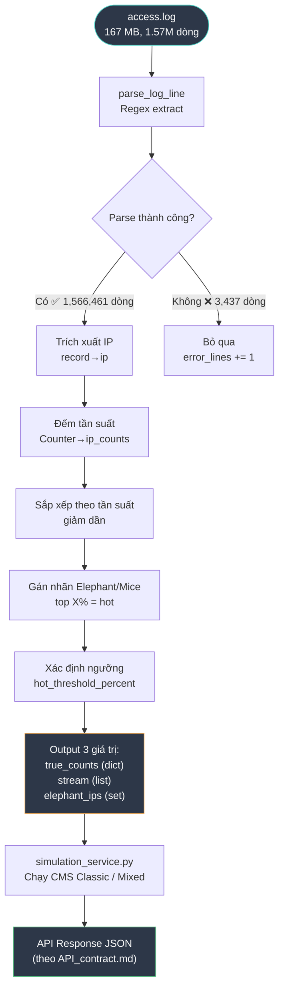
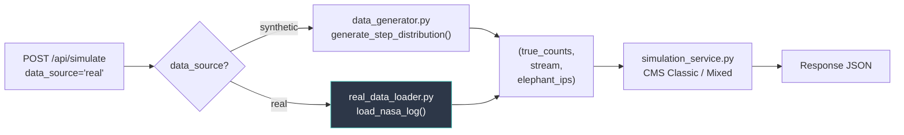

# Hướng dẫn kéo Data từ `access.log` cho báo cáo Count-Min Sketch

> **Mục đích:** Tài liệu hóa toàn bộ quy trình đọc, parse, chuyển đổi dữ liệu từ file `access.log` (NASA HTTP Access Log) để đưa vào hệ thống demo Elephant/Mice CMS — phục vụ nhánh `data_source = "real"` trong API.

---

## 1. Tổng quan Dataset

| Thuộc tính | Chi tiết |
|---|---|
| **Tên** | NASA Kennedy Space Center HTTP Access Log |
| **Nguồn gốc** | https://ita.ee.lbl.gov/html/contrib/NASA-HTTP.html |
| **Kaggle** | https://www.kaggle.com/datasets/shawon10/web-log-dataset |
| **File sử dụng** | `access.log` (~167 MB) |
| **Tổng dòng** | 1,569,898 |
| **Dòng parse được** | 1,566,461 (99.78%) |
| **Dòng lỗi / bỏ qua** | 3,437 (0.22%) |
| **Định dạng** | Apache Common Log Format (CLF) |

---

## 2. Cấu trúc một dòng log

### 2.1 Ví dụ dòng raw

```
in24.inetnebr.com - - [01/Aug/1995:00:00:01 -0400] "GET /shuttle/missions/sts-68/news/sts-68-mcc-05.txt HTTP/1.0" 200 1839
```

### 2.2 Bảng phân tích từng trường

| # | Trường | Ví dụ | Kiểu dữ liệu gốc (trong file) | Kiểu logic (khi parse / lưu DB) | Mô tả |
|---|---|---|---|---|---|
| 1 | **Host / IP** | `in24.inetnebr.com` | String (plain text) | `VARCHAR` / `INET` / **String** | Hostname hoặc địa chỉ IPv4 của client gửi request |
| 2 | **RFC 1413 Identity** | `-` | String | `VARCHAR` (thường `NULL`) | Định danh client theo RFC 1413. Hầu như luôn là `-` (không xác định) |
| 3 | **Username** | `-` | String | `VARCHAR` (thường `NULL`) | User ID nếu có HTTP Basic Auth. Hầu như luôn là `-` |
| 4 | **Timestamp** | `[01/Aug/1995:00:00:01 -0400]` | String (formatted) | `DATETIME` / `TIMESTAMP WITH TZ` | Thời điểm server nhận request. Format: `[dd/Mon/yyyy:HH:mm:ss ±zzzz]` |
| 5 | **HTTP Method** | `GET` | String | `ENUM` / `VARCHAR(10)` | Phương thức HTTP: `GET`, `POST`, `HEAD`, `PUT`, `DELETE`... |
| 6 | **Request URL** | `/shuttle/.../sts-68-mcc-05.txt` | String | `TEXT` / `VARCHAR(2048)` | Đường dẫn tài nguyên được yêu cầu |
| 7 | **HTTP Version** | `HTTP/1.0` | String | `ENUM` / `VARCHAR(10)` | Phiên bản giao thức HTTP (`HTTP/1.0` hoặc `HTTP/1.1`) |
| 8 | **Status Code** | `200` | String (chữ số) | **Integer** (`SMALLINT`) | Mã phản hồi HTTP. Giá trị từ 100–599. Cần ép kiểu `int()` khi parse |
| 9 | **Response Size** | `1839` | String (chữ số hoặc `-`) | **Integer** (`BIGINT`) hoặc `NULL` | Kích thước phản hồi (bytes). ⚠️ Có thể là `-` khi không có body → cần xử lý thành `0` hoặc `NULL` |

> [!IMPORTANT]
> Trong file text, **mọi trường đều được lưu dưới dạng chuỗi ký tự (String)**. Các trường như Status Code và Response Size cần được **ép kiểu thủ công** khi parse bằng code.

---

## 3. Regex parse dòng log

### 3.1 Pattern sử dụng trong `analyze_nasa_log.py`

```python
pattern = r'^(\S+) \S+ \S+ \[.*?\] "(\S+) (\S+) \S+" (\d+) (\S+)'
```

### 3.2 Bảng ánh xạ nhóm capture

| Nhóm | Regex | Trường trích xuất | Ép kiểu | Ghi chú |
|---|---|---|---|---|
| `group(1)` | `(\S+)` — đầu dòng | **Host / IP** | Giữ nguyên `str` | Có thể là hostname (`edams.ksc.nasa.gov`) hoặc IP (`163.206.89.4`) |
| — | `\S+ \S+` | RFC 1413 + Username | Bỏ qua | Hầu như luôn là `- -`, không cần thiết cho CMS |
| — | `\[.*?\]` | Timestamp | Bỏ qua | Có thể parse thêm nếu cần phân tích theo thời gian |
| `group(2)` | `(\S+)` — trong dấu `"` | **HTTP Method** | Giữ nguyên `str` | `GET`, `POST`, `HEAD`... |
| `group(3)` | `(\S+)` — trong dấu `"` | **Request URL** | Giữ nguyên `str` | Đường dẫn tài nguyên |
| — | `\S+` — cuối dấu `"` | HTTP Version | Bỏ qua | `HTTP/1.0` hoặc `HTTP/1.1` |
| `group(4)` | `(\d+)` | **Status Code** | `int()` | Mã HTTP: 200, 304, 404... |
| `group(5)` | `(\S+)` | **Response Size** | `int()` hoặc `0` | ⚠️ Có thể là `-` → cần xử lý đặc biệt |

### 3.3 Code parse hoàn chỉnh (trích từ `analyze_nasa_log.py`)

```python
import re

def parse_log_line(line):
    """Parse 1 dòng Apache Common Log Format."""
    pattern = r'^(\S+) \S+ \S+ \[.*?\] "(\S+) (\S+) \S+" (\d+) (\S+)'
    m = re.match(pattern, line)
    if m:
        return {
            "ip":     m.group(1),       # str  — Host/IP
            "method": m.group(2),       # str  — HTTP Method
            "url":    m.group(3),       # str  — Request URL
            "status": int(m.group(4)),  # int  — Status Code
        }
    return None
```

> [!NOTE]
> Script hiện tại chỉ trích xuất 4 trường (`ip`, `method`, `url`, `status`).
> Trường `response_size` (group 5) đã được capture bởi regex nhưng chưa đưa vào dict.
> Nếu báo cáo cần phân tích kích thước, có thể thêm:
> ```python
> "size": int(m.group(5)) if m.group(5) != '-' else 0
> ```

---

## 4. Pipeline: Từ `access.log` → CMS Engine

### 4.1 Sơ đồ luồng dữ liệu



### 4.2 Chi tiết từng bước

#### Bước 1 — Đọc file và parse

```python
ips = []
with open("access.log", "r", errors="replace") as f:
    for line in f:
        record = parse_log_line(line.strip())
        if record:
            ips.append(record["ip"])
```

- Dùng `errors="replace"` để tránh crash khi gặp ký tự không hợp lệ
- Chỉ cần trường `ip` cho CMS (Count-Min Sketch đếm tần suất IP)

#### Bước 2 — Đếm tần suất thực tế (Ground Truth)

```python
from collections import Counter

ip_counts = Counter(ips)         # dict: {ip: số_lần_xuất_hiện}
true_counts = dict(ip_counts)    # chuyển sang dict chuẩn
```

Kết quả thống kê từ `access.log`:

| Chỉ số | Giá trị |
|---|---|
| Tổng IP phân biệt | 74,957 |
| IP xuất hiện nhiều nhất | 6,516 lần (`edams.ksc.nasa.gov`) |
| IP xuất hiện ít nhất | 1 lần |
| Trung bình mỗi IP | 20.9 lần |
| Beta Zipf (IP) | 1.042 (phân phối Zipf điển hình) |

#### Bước 3 — Tạo stream

```python
stream = ips  # danh sách IP theo thứ tự xuất hiện trong log
# Không cần shuffle — data thực đã có thứ tự tự nhiên
```

#### Bước 4 — Gán nhãn Elephant / Mice

```python
sorted_ips = sorted(ip_counts.items(), key=lambda x: x[1], reverse=True)

# Ngưỡng: top X% IP tần suất cao nhất = Elephant
hot_threshold_percent = 0.05  # top 5%
n_hot = max(1, int(len(sorted_ips) * hot_threshold_percent))
elephant_ips = set(ip for ip, _ in sorted_ips[:n_hot])
```

Kết quả phân nhóm (với ngưỡng trung bình = 21 requests):

| Nhóm | Số IP | Tổng requests | % traffic |
|---|---|---|---|
| **Hot (Elephant)** | 16,671 | 1,098,867 | 70.1% |
| **Cold (Mice)** | 58,286 | 467,594 | 29.9% |
| **Gap factor** | — | — | 8.2× |

#### Bước 5 — Output chuẩn (cùng interface với data giả lập)

```python
def load_nasa_log(filepath="access.log", hot_threshold_percent=0.05):
    """
    Load NASA access log và trả về cùng format với generate_step_distribution().

    Returns:
        true_counts (dict):    {ip_string: int} — số lần xuất hiện thật
        stream (list):         [ip_string, ...] — danh sách IP theo thứ tự log
        elephant_ips (set):    {ip_string, ...} — tập IP được gán nhãn hot
    """
    ips = []
    with open(filepath, "r", errors="replace") as f:
        for line in f:
            record = parse_log_line(line.strip())
            if record:
                ips.append(record["ip"])

    ip_counts = Counter(ips)
    true_counts = dict(ip_counts)
    stream = ips

    sorted_ips = sorted(ip_counts.items(), key=lambda x: x[1], reverse=True)
    n_hot = max(1, int(len(sorted_ips) * hot_threshold_percent))
    elephant_ips = set(ip for ip, _ in sorted_ips[:n_hot])

    return true_counts, stream, elephant_ips
```

---

## 5. Kết nối với API (`API_contract.md`)

### 5.1 Request khi dùng data thực

Khi frontend gọi API với `data_source = "real"`, **không cần gửi** `n_hot`, `n_cold`, `gap_factor`, `total_packets` — các giá trị này được suy ra từ `access.log`:

```json
{
  "algorithm": "classic",
  "data_source": "real",
  "table_size": 5000
}
```

### 5.2 Luồng xử lý phía Backend



### 5.3 Ánh xạ data → Response fields

| Dữ liệu từ `access.log` | Cách tính | Response field (API) | Kiểu |
|---|---|---|---|
| `len(elephant_ips)` | Số IP trong tập hot | `elephant_total` | `integer` |
| Top-k CMS ∩ elephant_ips | Đếm đúng | `elephant_detected` | `integer` |
| `(estimate - true) / true` | Trung bình trên Mice | `mice_avg_error` | `float` |
| Top 10 IP theo CMS estimate | Sort + slice | `top10[]` | `array` |
| `hot_threshold_percent` | Tham số cấu hình | `real_meta.hot_threshold_percent` | `float` |
| `len(ip_counts)` = 74,957 | Đếm IP duy nhất | `real_meta.total_unique_ips` | `integer` |

### 5.4 Response mẫu kỳ vọng (data thực)

```json
{
  "data_source": "real",
  "algorithm": "classic",
  "elephant_detected": 4,
  "elephant_total": 6,
  "mice_avg_error": 0.31,
  "real_meta": {
    "hot_threshold_percent": 0.05,
    "total_unique_ips": 74957
  },
  "top10": [
    {
      "ip": "edams.ksc.nasa.gov",
      "true_count": 6516,
      "estimate": 7200,
      "is_elephant": true
    },
    {
      "ip": "piweba4y.prodigy.com",
      "true_count": 4846,
      "estimate": 5100,
      "is_elephant": true
    }
  ]
}
```

---

## 6. Các trường hợp đặc biệt cần xử lý

### 6.1 Dòng log không parse được (3,437 dòng)

Nguyên nhân phổ biến:
- Request line bị cắt hoặc không đúng format: `"GET"` thiếu URL
- Ký tự đặc biệt hoặc encoding lỗi
- Dòng trống hoặc dòng metadata của server

**Cách xử lý:** Bỏ qua (skip) — chiếm 0.22%, không ảnh hưởng đáng kể đến phân phối.

### 6.2 Trường Response Size là `-`

```python
# Trong log: "GET /path HTTP/1.0" 304 -
# `-` nghĩa là server không trả body (ví dụ: 304 Not Modified)

size_str = m.group(5)
size = int(size_str) if size_str != '-' else 0
```

### 6.3 Host là hostname vs IP

Trong `access.log`, trường Host có thể là:
- **Hostname:** `edams.ksc.nasa.gov`, `piweba4y.prodigy.com`
- **Địa chỉ IP:** `163.206.89.4`, `202.249.77.5`

**Cách xử lý:** Giữ nguyên cả hai dạng — CMS chỉ cần chuỗi duy nhất để hash, không cần phân biệt hostname và IP.

---

## 7. Thống kê quan trọng cho báo cáo

### 7.1 Đặc điểm phân phối

| Chỉ số | Giá trị | Ý nghĩa cho CMS |
|---|---|---|
| **Beta Zipf (IP)** | 1.042 | Phân phối Zipf điển hình — khớp Section 3.3 bài báo |
| **Beta Zipf (URL)** | 1.671 | Skew mạnh hơn — ít URL chiếm rất nhiều traffic |
| **Top 1% IP** | 749 IPs chiếm 24.7% traffic | Elephant flows tồn tại rõ ràng |
| **Gap factor** | 8.2× | Hot IP truy cập trung bình gấp 8.2 lần Cold IP |

### 7.2 Phân vị tần suất IP

| Phân vị | Số requests | Diễn giải |
|---|---|---|
| P50 (median) | 9 | Một nửa số IP truy cập ≤ 9 lần |
| P90 | 37 | 90% IP truy cập ≤ 37 lần |
| P99 | 190 | Chỉ 1% IP truy cập > 190 lần |
| P99.9 | 825 | Top 0.1% IP truy cập > 825 lần |
| Max | 6,516 | IP nhiều nhất: `edams.ksc.nasa.gov` |

### 7.3 Tại sao chọn NASA log cho báo cáo CMS?

1. **Phân phối Zipf tự nhiên** (β ≈ 1.042) — khớp trực tiếp với thực nghiệm Section 3.3 bài báo Fusy & Kucherov
2. **Heavy hitter rõ ràng** — top 1% IP chiếm gần 25% traffic → bài toán Elephant detection có ý nghĩa
3. **Ứng dụng thực tế** — network traffic monitoring là use case chính của CMS được đề cập trong Section 1 bài báo (trích [20] Estan & Varghese, 2002)
4. **Kích thước phù hợp** — 1.57M requests đủ lớn để stress test CMS, đủ nhỏ để chạy demo nhanh

---

## 8. Tham số CMS gợi ý cho data thực

| Tham số | Giá trị gợi ý | Lý do |
|---|---|---|
| `table_size` (n) | 5,000 | λ = 74,957 / 5,000 ≈ 15 → supercritical, thách thức CMS |
| `k` (classic) | 3 | Giá trị chuẩn trong bài báo |
| `k_hot` / `k_cold` (mixed) | 2 / 5 | Mixed CMS: ít hash cho hot, nhiều hash cho cold |
| `hot_threshold_percent` | 0.05 (5%) | Top 5% IP = Elephant, 95% còn lại = Mice |

---

## Tài liệu liên quan

- **Script phân tích:** `analyze_nasa_log.py` — parse và thống kê access.log
- **API Contract:** `API_contract.md` — định nghĩa request/response cho endpoint `/api/simulate`
- **Hướng dẫn xây dựng data:** `huongdan_xaydung_data.md` — bao gồm cả data giả lập và data thực
- **Pipeline tổng quát:** `data_pipeline_Thinh.md` — luồng từ kéo data đến vẽ đồ thị
- **Bài báo gốc:** Fusy, É., & Kucherov, G. (2023). *Count-min sketch with variable number of hash functions.*
